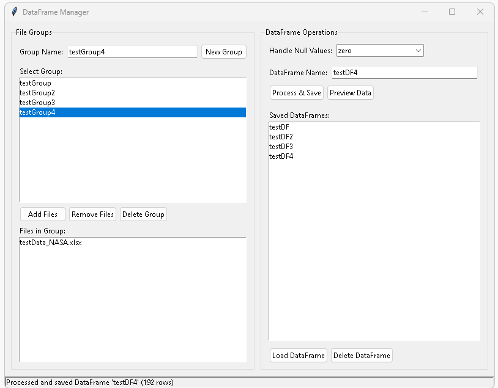
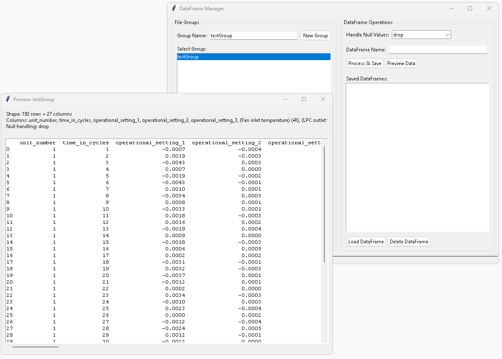
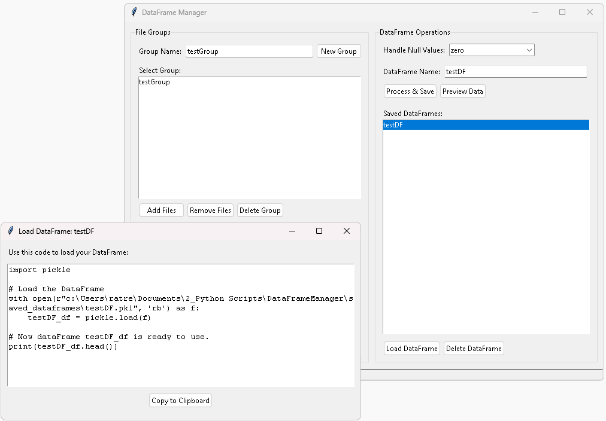

# DataFrame Manager

**DataFrame Manager** is a lightweight `tkinter` GUI tool I created that simplifies loading, organizing, processing, and reusing datasets. 


It supports reading **Excel (.xlsx, .csv)** files and **NPSS `.rowOut`** files, automatically converting them into `pandas` DataFrames.  

The app is designed to streamline the workflow of preparing data for analysis by combining file management, cleaning, and reusable storage into one interface.

---

## ✨ Features

- **File Loading**
  - Import `.csv`, `.xlsx`, or NPSS `.rowOut` files.
  - Convert loaded files directly into `pandas` DataFrames.

- **Groups**
  - Create groups to organize related files.
  - Add or remove files from groups as needed.

- **Preview & Null Handling**
  - Preview datasets before saving.
  - Handle null values with a dropdown option:
    - **Drop** → remove rows with nulls  
    - **Zero** → replace nulls with `0`  
    - **Keep** → leave nulls unchanged  

- **Save & Reuse DataFrames**
  - Process and save DataFrames with a custom name.
  - DataFrames are stored automatically in a `stored_dataframes/` folder.
  - After saving, a popup provides a **copy-to-clipboard** code snippet so you can quickly load the DataFrame in your script.

- **Deletion Options**
  - Delete individual files, groups, or saved DataFrames from within the app.

---

## 🚀 Workflow

1. **Create a Group**  
   Start by creating a group for related files.  

2. **Add Files**  
   Import `.csv`, `.xlsx`, or `.rowOut` files into the group.  

3. **Preview & Handle Nulls**  
   Open a preview window and choose how to handle missing values.  

4. **Save DataFrame**  
   - Give your processed DataFrame a name.  
   - Click **Process and Save** → the DataFrame is stored in `stored_dataframes/`.  
   - A popup provides a one-line `pandas` code snippet to reload the DataFrame.  

5. **Manage**  
   Use the built-in buttons to delete files, groups, or saved DataFrames.  

---
**Data Frame Manager GUI**

Organize data files into Pandas Dataframes
<p align="left">
  
</p>

---
Preview data 👇 loaded from files and handle null values from drop down
<p align="left">
  
</p>

---
Easily load dataFrame into code by clicking "Copy to Clipboard" and paste into your code! 
<p align="left">
  
</p>

---
## Example: Loading a Saved DataFrame
⚠️ Needs Pandas library


```python
import pandas as pd


# When you save a DataFrame, the app provides a snippet like:

import pickle

# Load the DataFrame
with open(r"c:\Users\ratre\Documents\2_Python Scripts\DataFrameManager\saved_dataframes\testDF.pkl", 'rb') as f:
    testDF_df = pickle.load(f)
